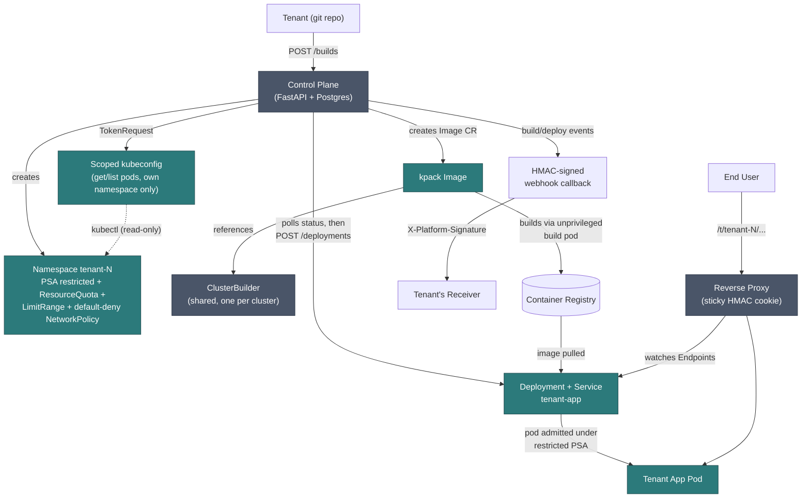

# multi-tenant-platform

A platform that lets tenants submit their own source code and have it built, deployed, and
run in isolated Kubernetes pods.

Each mechanism below was built and tested against a cluster, mostly local minikube, with
temporary AWS EKS used for anything minikube on this dev machine couldn't validate. EKS
resources were torn down right after verification to avoid ongoing cost.

## Status

**Phase 0 (architecture spikes), complete:**
- **Container builds under Pod Security Admission `restricted`**: kpack v0.18.0 builds a
  git repo into a container image using unprivileged Kubernetes primitives (no privileged
  pods, no user-namespace tricks). Checked the build pod's `securityContext` for compliance
  and confirmed the built image landed in the registry with a valid digest.
- **Session-affinity reverse proxy**: a hand-built ~100-line Node.js proxy watches backend
  pod `Endpoints` via the Kubernetes API and routes on an HMAC-signed sticky cookie. Tested
  with two cookie jars simulating two tenants, each consistently routed to a different
  backend pod across repeated requests. A forged cookie is rejected and falls back to a
  fresh, validly-signed assignment.
- **NetworkPolicy enforcement**: verified on temporary AWS EKS after Calico failed to start
  locally (a known nested-virtualization limitation on this dev machine's Windows/WSL2/
  Docker-driver stack). Found two EKS Auto Mode gotchas along the way: the Network Policy
  Controller isn't enabled by default (needs an explicit `kube-system/amazon-vpc-cni`
  ConfigMap), and CoreDNS isn't a normal pod a `namespaceSelector` rule can match under Auto
  Mode, it runs at a fixed IP derived from the cluster's Service CIDR, so egress needs an
  explicit `ipBlock` rule instead. A default-deny policy then blocked cross-namespace pod
  traffic while leaving DNS and unrestricted namespaces unaffected.

**Phase 1, control plane skeleton, complete:**
FastAPI + SQLAlchemy + Postgres control plane with `Tenant`, `APIKey`, `BuildJob`,
`Deployment`, and `WebhookRegistration` models, modeled on (not copied from)
self-healing-data-platform's control-plane shape. Tested against a local Postgres instance,
not just mocks: created a tenant via the running API, checked its `k8s_namespace` was
derived from its assigned id, created a build job and webhook registration under it,
confirmed deploying from a non-`succeeded` build returns 409, and confirmed a different
tenant's API key against this tenant's resources returns 403.

**Phase 2, the build pipeline, complete:** `POST /tenants/{id}/builds/` does the real
thing instead of a DB-only stub: creates the tenant's Kubernetes namespace and a
registry-push Secret/ServiceAccount in it (idempotently, safe to call on every build),
creates a kpack `Image` custom resource pointing at the tenant's git repo, and a FastAPI
`BackgroundTask` polls kpack's build status and writes the outcome
(`succeeded`/`failed`, the resolved image digest or an error message) back to the
`BuildJob` row. One shared, cluster-scoped kpack `ClusterBuilder`
(`k8s/bootstrap/kpack-platform-builder.yaml`) is referenced by every tenant's Image
resources instead of being recreated per tenant.

Verified end to end through the running API: `POST /tenants/2/builds/` with a git repo and
subPath created namespace `tenant-2`, which produced a kpack `Image` and build pod, and
polling `GET /tenants/2/builds/3` showed it transition from `building` to `succeeded` with
an image digest that was then confirmed to exist in ECR via `aws ecr describe-images`.

Three bugs found and fixed along the way:
1. **ECR doesn't auto-create nested repository paths.** The original tagging scheme
   (`registry/tenant-1/build-3`, a slash-separated path) failed with a `NAME_UNKNOWN` push
   error, ECR requires each repository to exist in advance and doesn't treat path segments
   as an implicit namespace like Docker Hub does. Fixed by switching to colon-separated
   tags within one existing repo (`registry:tenant-1-build-3`).
2. **A misleading kpack error message hid the cause above.** The `ClusterBuilder` reported
   "stack platform-base is not ready" even though the `ClusterStack` was `Ready: True`.
   Restarting the kpack-controller pod forced a fresh reconcile and surfaced the real
   `NAME_UNKNOWN` error underneath. Lesson: a generic kpack error doesn't always name the
   step that actually failed.
3. **kpack's `Image.spec.source.subPath` is a sibling of `git`, not nested inside it**, the
   same field-placement mistake from Phase 0's spike recurred here, and was fixed by
   checking kpack's Go source again. Added `git_sub_path` support
   (`BuildJobCreate.git_sub_path` -> `BuildJob.git_sub_path` -> the `Image` CR), which most
   monorepo tenant repos will need.

**Phase 3, isolation hardening and Deployments, complete:** `ensure_tenant_namespace` now
applies, at namespace-creation time: a `pod-security.kubernetes.io/enforce: restricted`
label, a `ResourceQuota` (2 CPU/4Gi requests, 4 CPU/8Gi limits, 20 pods), a `LimitRange`
(default 100m/128Mi per container), and a default-deny `NetworkPolicy` with a DNS-egress
exception. `POST /tenants/{id}/deployments/` now creates an actual Kubernetes `Deployment`
running the tenant's successfully-built image with a `restricted`-PSA-compliant
`securityContext`, and a `BackgroundTask` polls its rollout status into the `Deployment`
row, the same pattern as Phase 2's build polling.

Verified via `kubectl` that a fresh tenant's namespace carries the correct PSA label and
`ResourceQuota`/`LimitRange`/`NetworkPolicy` specs, including a DNS-egress rule that targets
the cluster's dynamically-discovered `kube-dns` ClusterIP rather than a hardcoded one. A
build's image was then deployed through `POST /deployments/`, and the resulting pod came up
`Running` with `allowPrivilegeEscalation: false`, `capabilities.drop: [ALL]`,
`runAsNonRoot: true`, and `seccompProfile: RuntimeDefault`, admitted cleanly under the
namespace's `restricted` enforcement.

Two bugs found and fixed:
1. **The Deployment's pod had no `imagePullSecrets`** and failed with `ImagePullBackOff`
   ("no basic auth credentials") because it didn't reuse the `ServiceAccount`
   `ensure_tenant_namespace` already wires with the registry pull secret. Fixed by setting
   `serviceAccountName` on the pod spec.
2. **`k8s.AppsV1Api()`/`k8s.NetworkingV1Api()` were instantiated directly**, bypassing
   `shared/k8s_client.py`'s `_ensure_configured()` step. This only worked in
   `ensure_tenant_namespace` because an earlier call in the same function had already
   configured the client globally; called from a fresh process (as
   `create_tenant_deployment` was), it failed with `No host specified`. Fixed by adding
   `get_apps_v1_api()`/`get_networking_v1_api()` getters and using them everywhere.

Not yet done: the OpenTelemetry sidecar. There's no OTel Collector target deployed anywhere
for this project yet, so wiring a sidecar with nothing to receive its spans is deferred.

**Phase 4, RBAC, complete:** `GET /tenants/{id}/kubeconfig` mints a short-lived (1-hour)
token via the Kubernetes `TokenRequest` API for a per-tenant `ServiceAccount` whose `Role`
grants only `get`/`list` on `pods`/`pods/log`, deliberately not `exec`/`attach`, scoped to
that tenant's own namespace, and wraps it in a ready-to-use kubeconfig YAML.

Verified by using the downloaded file directly: `kubectl --kubeconfig=<downloaded file> get
pods -n tenant-3` succeeded and listed pods; the same command against `kube-system` and
`kubectl get nodes` both returned `Forbidden`; `kubectl exec` into the tenant's own pod was
also `Forbidden`, confirming the Role is limited to read-only visibility.

Two more bugs found, both from trusting a remembered class name over checking the installed
client: `kubernetes` client 36.0.3 has no `V1Subject` (it's `RbacV1Subject`), caught via an
`AttributeError`. The unconfigured-client mistake from Phase 3 recurred with
`RbacAuthorizationV1Api()`, fixed the same way, and this class of mistake is now closed off
everywhere in this file.

**Phase 5, the session-affinity reverse proxy, complete:** wired in front of tenant
Deployments and verified across two tenants running at once. `create_tenant_deployment` now
creates one stable Deployment+Service per tenant (`tenant-app`, in their own namespace)
instead of one per build, a redeploy patches the existing Deployment's image in place. This
also gives the reverse proxy a fixed, discoverable address per tenant regardless of which
build is live. The Phase 0 sticky-proxy spike is now a platform-owned component
(`k8s/bootstrap/reverse-proxy.yaml`, its own namespace/ServiceAccount/ClusterRole, a
broader grant than any tenant's own Phase 4 RBAC since it routes traffic for tenants rather
than being one): requests to `/t/{tenant_id}/...` are routed to that tenant's `tenant-app`
Service, sticky per the same HMAC-cookie mechanism Phase 0 proved.

Verified live with two tenants deployed at once: `/t/3/...` and `/t/4/...` each served HTML
from their own backend pod (confirmed via a response header, 5 requests each, sticky and
never crossing between tenants); a request for a tenant with no running deployment got
`503` instead of a crash or silent misroute; and a forged cookie was rejected in favor of a
fresh, validly-signed one, same as Phase 0.

One bug found and fixed: the proxy's own pod (`node:20-alpine`, not a kpack-built image)
hit `CreateContainerConfigError` ("container has runAsNonRoot and image will run as root").
Unlike tenant app pods, which are kpack-built and run as non-root per the Cloud Native
Buildpacks spec, a raw upstream image like `node:20-alpine` defaults to root and needs an
explicit `runAsUser` to satisfy `runAsNonRoot: true`. Fixed by setting `runAsUser: 1000`.

**Phase 6, HMAC-signed webhook callbacks with replay protection, complete:** verified
against an independent receiver process, not just round-tripped against the platform's own
code. `WebhookDelivery` records every attempt (audit trail, same idea as
self-healing-data-platform's `WebhookCallback`); build and deployment completion both
dispatch a signed `POST` to every active registration for that tenant, with headers
`X-Platform-Signature: sha256=<hex hmac of "{timestamp}.{body}">` and
`X-Platform-Timestamp`, the same shape as GitHub's/Stripe's signed-webhook convention.

Verified with `scripts/webhook_test_receiver.py`, a standalone HTTP server run as its own
process that independently recomputes the HMAC the way a tenant's receiver would: a build's
completion produced a signed delivery the receiver accepted (200, recorded
`status="success"` in `webhook_deliveries`); a payload tampered with after signing was
rejected (401, signature mismatch); a validly-signed request with a timestamp 400 seconds
old was rejected (401, outside the 300s replay window); and a control request with a fresh
timestamp and correct signature was accepted.

**Phase 7 (this state of the repo), consolidation:** a Mermaid architecture diagram
(above) and `scripts/demo_end_to_end.sh`, a single runnable script covering the whole
two-tenant build, deploy, RBAC, and routing flow (see "Running the full demo" below for
what it does and doesn't claim to have verified).

**Phase 8, not started** (optional: a temporary EKS pass mirroring
self-healing-data-platform's deploy-test-teardown discipline, reusing its
`infra/aws/eks.tf` pattern). Everything so far was verified on local minikube plus, where
minikube couldn't (NetworkPolicy enforcement, Phase 0), on temporary EKS, so the platform's
core mechanisms are already proven on the real target (EKS), just not yet as one continuous
cloud deployment.

## Architecture



One mechanism per JD phrase, each independently demoable once built:

| JD mechanism | Approach | Status |
|---|---|---|
| Container image builds | kpack (CNCF Cloud Native Buildpacks), in-cluster, no privileged pods, driven by the control plane's own `POST /builds` endpoint | Verified end-to-end (Phase 0 + Phase 2) |
| Workload isolation | Namespace-per-tenant + default-deny `NetworkPolicy` + Pod Security Admission `restricted` + `ResourceQuota`/`LimitRange` | Verified end-to-end (Phase 0 + Phase 3), all applied at namespace-creation time, confirmed via `kubectl` and a pod admitted under `restricted` |
| RBAC | Control plane operates via its own privileged ServiceAccount; tenants get a scoped `ServiceAccount`+`Role`+`RoleBinding` and a `TokenRequest`-minted kubeconfig limited to their own namespace | Verified end-to-end (Phase 4), a downloaded kubeconfig works in-namespace and is `Forbidden` everywhere else, including `exec` |
| Secure callback architecture | HMAC-SHA256-signed webhooks with timestamp-based replay protection | Verified end-to-end (Phase 6) against an independent receiver, delivery accepted, tampered payload and replayed timestamp both rejected |
| Session-affinity reverse proxy | Hand-built sticky-cookie proxy watching K8s `Endpoints`, routing `/t/{tenant_id}/...` | Verified end-to-end (Phase 0 + Phase 5), two tenants served simultaneously, each consistently routed to their own pod |
| Sidecars | OpenTelemetry Collector sidecar per tenant pod | Deferred, no reason to wire a sidecar with no Collector target yet; revisit alongside Phase 5 or later |

## Why this exists

Built to close a gap found during a portfolio audit: no project anywhere builds/deploys
arbitrary user-submitted code into isolated Kubernetes pods with RBAC and a
session-affinity reverse proxy, every "multi-tenant" mention elsewhere was either an
unbuilt roadmap item or unrelated infrastructure-service RBAC. This also maps directly to a
core Responsibility in the target JD, not just a preferred qualification.

## Local development

```bash
cp .env.example .env   # then fill in API_KEY_SECRET / ADMIN_SECRET_KEY
                        # generate with: python -c "import secrets; print(secrets.token_urlsafe(32))"

docker compose up -d           # starts Postgres on localhost:5435
python -m venv venv
venv\Scripts\pip install -r requirements.txt
venv\Scripts\python -m alembic upgrade head
venv\Scripts\python -m uvicorn control_plane.app.main:app --port 8010
```

Create a tenant (admin-only):

```bash
curl -X POST http://127.0.0.1:8010/tenants/ \
  -H "X-Admin-Secret: $ADMIN_SECRET_KEY" \
  -H "Content-Type: application/json" \
  -d '{"name":"acme-corp"}'
```

The response includes a one-time API key; use it as `X-API-Key` on every
`/tenants/{tenant_id}/...` route.

### Enabling real builds (Phase 2)

Requires a Kubernetes cluster with kpack installed (`kubectl apply` the
[kpack release manifest](https://github.com/buildpacks-community/kpack/releases)) and a
container registry the control plane can push to. Local dev used minikube plus a temporary
ECR repo; any registry works as long as `IMAGE_REGISTRY`/`REGISTRY_SERVER`/
`REGISTRY_USERNAME`/`REGISTRY_PASSWORD` point at one you control.

```bash
# one-time, cluster-scoped: creates the shared ClusterBuilder every tenant's builds use
kubectl create secret docker-registry platform-registry-credentials \
  --docker-server=$REGISTRY_SERVER --docker-username=$REGISTRY_USERNAME \
  --docker-password=$REGISTRY_PASSWORD --namespace kpack
kubectl apply -f k8s/bootstrap/kpack-platform-builder.yaml   # substitute IMAGE_REGISTRY into its `tag:` field first
```

Then fill in `.env`'s Phase 2 section (`KUBECONFIG_PATH`/`IN_CLUSTER`, `IMAGE_REGISTRY`,
`REGISTRY_*`) and submit a build:

```bash
curl -X POST http://127.0.0.1:8010/tenants/1/builds/ \
  -H "X-API-Key: $API_KEY" -H "Content-Type: application/json" \
  -d '{"git_url":"https://github.com/paketo-buildpacks/samples","git_revision":"main","git_sub_path":"nodejs/npm"}'
```

Poll `GET /tenants/1/builds/{id}` until `status` is `succeeded` or `failed`.

### Enabling the reverse proxy (Phase 5) and webhook testing (Phase 6)

```bash
kubectl create secret generic reverse-proxy-secret --namespace platform \
  --from-literal=cookie-secret=$(openssl rand -hex 32)
kubectl apply -f k8s/bootstrap/reverse-proxy.yaml
kubectl create configmap reverse-proxy-script --namespace platform \
  --from-file=sticky-proxy.js=k8s/proxy/sticky-proxy.js
kubectl port-forward -n platform svc/reverse-proxy 3000:3000   # then curl http://127.0.0.1:3000/t/1/
```

For webhooks, register a callback (`POST /tenants/1/webhooks/`), then run
`python scripts/webhook_test_receiver.py <signing_secret>`, a standalone receiver that
verifies every delivery's signature and rejects stale timestamps.

### Running the full demo

`scripts/demo_end_to_end.sh` scripts the whole flow (two tenants, two builds, two
deployments, RBAC isolation, and session-affinity routing) into one runnable script, so
it's reproducible rather than something to take on faith. It consolidates the command
sequences already run by hand during Phases 0-6 (see Status above for each phase's
results), but hasn't itself been run start-to-finish as a single script against a fresh
cluster, so treat a first run as a real test: check its `PASS`/`FAIL` output rather than
assuming success.

```bash
ADMIN_SECRET_KEY=$ADMIN_SECRET_KEY bash scripts/demo_end_to_end.sh
```

## Tests

```bash
venv\Scripts\python -m pytest
```

21 tests covering the service-layer logic worth locking down: the
flush-then-derive-namespace ordering in tenant creation, cross-tenant/not-yet-built
deployment rejection, the auth dependency's cross-tenant/inactive-tenant rejection paths,
the build pipeline's error handling when Kubernetes calls fail (this happened repeatedly
during Phase 2 development, see Status above), the Kubernetes Deployment/Service creation
logic from Phase 3, the kubeconfig/RBAC token-minting logic from Phase 4, and the webhook
signing/delivery logic from Phase 6. Kubernetes/kpack calls are mocked in these tests; the
real cluster interaction was verified live (see Status above for each phase) rather than
re-verified here, the mocks test this code's own control flow, not Kubernetes or kpack
themselves.
