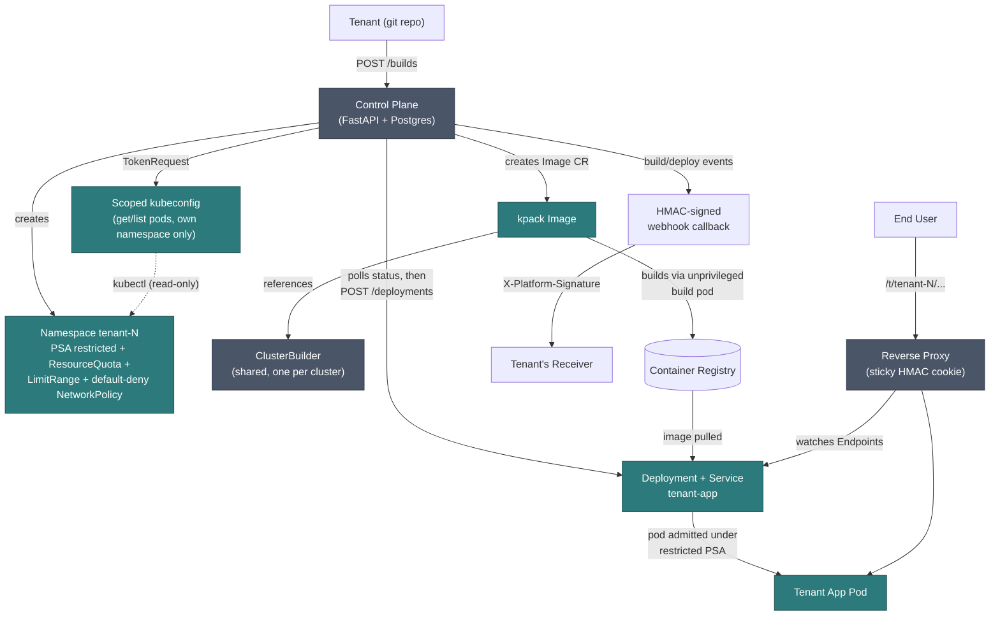

# multi-tenant-platform

A small platform where a tenant submits a git repo and gets it built, deployed and served
from its own isolated Kubernetes namespace. I built it to learn the pieces that sit
between "a user gave me code" and "it runs safely next to other people's code": image
builds, workload isolation, RBAC, signed callbacks and session affinity.

Most of it was run against local minikube. Two things minikube on my machine couldn't
check (NetworkPolicy enforcement and the real registry), I checked on a temporary AWS EKS
cluster and then tore it down.

## What it does

1. `POST /tenants/{id}/builds/` creates the tenant's namespace and a kpack `Image`. kpack
   builds the repo with buildpacks, without privileged pods. A background task polls the
   build and writes the result (image digest or error) back to the `BuildJob` row.
2. `POST /tenants/{id}/deployments/` runs a successful build as a Deployment and Service
   called `tenant-app` in the tenant's namespace. A redeploy patches the image in place.
3. `GET /tenants/{id}/kubeconfig` returns a 1 hour kubeconfig for a per-tenant
   ServiceAccount that can only `get` and `list` pods and pod logs in its own namespace.
4. Build and deployment completion send an HMAC-SHA256 signed webhook to the tenant's
   registered URLs. Every attempt is stored in `webhook_deliveries`.
5. A reverse proxy serves `/t/{tenant_id}/...` and keeps each client on one pod with a
   signed cookie.

Every new tenant namespace gets, when it is created: the `restricted` Pod Security label, a
ResourceQuota (2 CPU / 4Gi requests, 4 CPU / 8Gi limits, 20 pods), a LimitRange, and a
default-deny NetworkPolicy that still allows DNS. The DNS rule points at the ClusterIP of
the `kube-dns` Service, which is looked up rather than hardcoded.

## Architecture


```mermaid
flowchart TB
    Tenant["Tenant (git repo)"] -->|"POST /builds"| CP["Control Plane<br/>(FastAPI + Postgres)"]
    CP -->|"creates"| NS["Namespace tenant-N<br/>PSA restricted + ResourceQuota +<br/>LimitRange + default-deny NetworkPolicy"]
    CP -->|"creates Image CR"| Image["kpack Image"]
    Image -->|"references"| CB["ClusterBuilder<br/>(shared, one per cluster)"]
    Image -->|"builds via unprivileged<br/>build pod"| Reg[("Container Registry")]
    CP -->|"polls status, then<br/>POST /deployments"| Deploy["Deployment + Service<br/>tenant-app"]
    Reg -->|"image pulled"| Deploy
    Deploy -->|"pod admitted under<br/>restricted PSA"| Pod["Tenant App Pod"]
    CP -->|"build/deploy events"| Webhook["HMAC-signed<br/>webhook callback"]
    Webhook -->|"X-Platform-Signature"| Receiver["Tenant's Receiver"]
    CP -->|"TokenRequest"| Kubeconfig["Scoped kubeconfig<br/>(get/list pods, own namespace only)"]
    Kubeconfig -.->|"kubectl (read-only)"| NS
    User["End User"] -->|"/t/tenant-N/..."| Proxy["Reverse Proxy<br/>(sticky HMAC cookie)"]
    Proxy -->|"watches Endpoints"| Deploy
    Proxy --> Pod

    classDef platform fill:#4a5568,color:#fff,stroke:#2d3748
    classDef tenant fill:#2c7a7b,color:#fff,stroke:#234e52
    class CP,Proxy,CB platform
    class NS,Image,Deploy,Pod,Kubeconfig tenant
```

## What was checked, and how

| Piece | Checked by |
|---|---|
| kpack builds under `restricted` | Built a public Node sample. The build pod's securityContext was compliant and the image digest showed up in ECR. |
| NetworkPolicy | On temporary EKS. A pod in a default-deny namespace timed out reaching another namespace, an unrestricted control pod could reach the same target, and DNS still resolved. |
| Namespace hardening | `kubectl` on a new tenant, then a deployed pod was admitted under `restricted` with no privilege escalation, all capabilities dropped and a RuntimeDefault seccomp profile. |
| RBAC | Used a downloaded kubeconfig. `get pods` in its namespace worked. `kube-system`, `get nodes` and `exec` into its own pod were Forbidden. |
| Webhooks | Ran `scripts/webhook_test_receiver.py` as a separate process that recomputes the HMAC. A normal delivery was accepted. A tampered body and a request signed 400 seconds ago (window is 300) got 401. A fresh request was accepted again. |
| Reverse proxy | Two tenants running at once, 5 requests each. Each stayed on its own pod (checked with a response header). A tenant with no deployment got 503. A forged cookie was ignored and replaced. |

The unit tests (39) cover the control flow and the objects this code asks Kubernetes to
create, with the Kubernetes calls mocked. They don't test Kubernetes or kpack, that part was
checked by hand as above.

## Build order

Code comments and test docstrings refer to these phases.

- Phase 0: three throwaway spikes: kpack under `restricted`, NetworkPolicy enforcement, a sticky proxy.
- Phase 1: control plane with tenants, API keys, build jobs, deployments and webhook registrations.
- Phase 2: real builds through kpack, with status polled back into the database.
- Phase 3: namespace hardening (Pod Security, quota, NetworkPolicy) and tenant Deployments.
- Phase 4: per-tenant RBAC and the scoped kubeconfig endpoint.
- Phase 5: one stable Deployment and Service per tenant, and the reverse proxy in front.
- Phase 6: signed webhooks with replay protection.
- Phase 7: the diagram and the demo script.

## Things that broke

- **ECR and nested repository paths.** Tagging images as `registry/tenant-1/build-3`
  failed with `NAME_UNKNOWN`, because ECR needs each repository to exist first. Now it is
  one repo with tags like `registry:tenant-1-build-3`.
- **A kpack error hid the real one.** The ClusterBuilder said the stack was not ready while
  the ClusterStack was fine. Restarting the kpack controller forced a new reconcile and
  showed the `NAME_UNKNOWN` error underneath.
- **`subPath` sits next to `git`, not inside it.** I got this wrong twice, before and after
  checking kpack's Go source. It is now a `git_sub_path` field for monorepos.
- **Deployment pods had no image pull secret.** They went to `ImagePullBackOff` until I set
  `serviceAccountName` to the ServiceAccount that already carries the secret.
- **Kubernetes client used before it was configured.** `AppsV1Api()` and friends worked
  only when an earlier call had configured the client. From a fresh process they failed
  with `No host specified`. Everything now goes through `shared/k8s_client.py`.
- **Client class names.** `V1Subject` doesn't exist in `kubernetes` 36.0.3, it is
  `RbacV1Subject`.
- **Proxy pod ran as root.** `node:20-alpine` needs an explicit `runAsUser` to satisfy
  `runAsNonRoot`. kpack-built tenant images don't, they are non-root already.
- **EKS Auto Mode and NetworkPolicy.** The policy controller is off by default and needs
  the `kube-system/amazon-vpc-cni` ConfigMap (`enable-network-policy-controller: "true"`).
  CoreDNS also isn't a pod a `namespaceSelector` can match there, so DNS egress needs an
  `ipBlock` for the DNS Service IP.
- **Calico on minikube.** It would not start on my Windows/WSL2/Docker setup (the
  `ebpf-bootstrap` init container needs `/sys/kernel/security`), which is why the
  NetworkPolicy check went to EKS.

## Not done

- The OpenTelemetry sidecar per tenant pod. Nothing is collecting the spans yet.
- A full run on one EKS cluster. Each piece was checked on minikube or EKS separately.
- `scripts/demo_end_to_end.sh` scripts the whole two tenant flow, but I haven't run it start
  to finish on a fresh cluster. Everything in it was run by hand. Treat a first run as a
  test and read its PASS/FAIL lines.
- The reverse proxy is the Node one in `k8s/proxy/`. It reads `Endpoints` and verifies
  cookies with a plain string compare.

## Local development

```bash
cp .env.example .env   # then fill in API_KEY_SECRET / ADMIN_SECRET_KEY
                        # generate with: python -c "import secrets; print(secrets.token_urlsafe(32))"

docker compose up -d           # starts Postgres on localhost:5435
python -m venv venv
venv\Scripts\pip install -r requirements.txt
venv\Scripts\python -m alembic upgrade head
venv\Scripts\python -m uvicorn control_plane.app.main:app --port 8010
```

Create a tenant (admin-only):

```bash
curl -X POST http://127.0.0.1:8010/tenants/ \
  -H "X-Admin-Secret: $ADMIN_SECRET_KEY" \
  -H "Content-Type: application/json" \
  -d '{"name":"acme-corp"}'
```

The response includes a one-time API key; use it as `X-API-Key` on every
`/tenants/{tenant_id}/...` route.

### Enabling real builds

Requires a Kubernetes cluster with kpack installed (`kubectl apply` the
[kpack release manifest](https://github.com/buildpacks-community/kpack/releases)) and a
container registry the control plane can push to. Local dev used minikube plus a temporary
ECR repo; any registry works as long as `IMAGE_REGISTRY`/`REGISTRY_SERVER`/
`REGISTRY_USERNAME`/`REGISTRY_PASSWORD` point at one you control.

```bash
# one-time, cluster-scoped: creates the shared ClusterBuilder every tenant's builds use
kubectl create secret docker-registry platform-registry-credentials \
  --docker-server=$REGISTRY_SERVER --docker-username=$REGISTRY_USERNAME \
  --docker-password=$REGISTRY_PASSWORD --namespace kpack
kubectl apply -f k8s/bootstrap/kpack-platform-builder.yaml   # substitute IMAGE_REGISTRY into its `tag:` field first
```

Then fill in the build section of `.env` (`KUBECONFIG_PATH`/`IN_CLUSTER`, `IMAGE_REGISTRY`,
`REGISTRY_*`) and submit a build:

```bash
curl -X POST http://127.0.0.1:8010/tenants/1/builds/ \
  -H "X-API-Key: $API_KEY" -H "Content-Type: application/json" \
  -d '{"git_url":"https://github.com/paketo-buildpacks/samples","git_revision":"main","git_sub_path":"nodejs/npm"}'
```

Poll `GET /tenants/1/builds/{id}` until `status` is `succeeded` or `failed`.

### Reverse proxy and webhook testing

```bash
kubectl create secret generic reverse-proxy-secret --namespace platform \
  --from-literal=cookie-secret=$(openssl rand -hex 32)
kubectl apply -f k8s/bootstrap/reverse-proxy.yaml
kubectl create configmap reverse-proxy-script --namespace platform \
  --from-file=sticky-proxy.js=k8s/proxy/sticky-proxy.js
kubectl port-forward -n platform svc/reverse-proxy 3000:3000   # then curl http://127.0.0.1:3000/t/1/
```

For webhooks, register a callback (`POST /tenants/1/webhooks/`), then run
`python scripts/webhook_test_receiver.py <signing_secret>`, a standalone receiver that
verifies every delivery's signature and rejects stale timestamps.

### Running the full demo

`scripts/demo_end_to_end.sh` runs the two tenant flow in one go: two builds, two
deployments, the RBAC checks and the routing check. It is the same commands I ran by hand
while building this, but I haven't run it start to finish on a fresh cluster yet, so read
its PASS/FAIL lines instead of assuming it works.

```bash
ADMIN_SECRET_KEY=$ADMIN_SECRET_KEY bash scripts/demo_end_to_end.sh
```

## Tests

```bash
venv\Scripts\python -m pytest
```

39 tests. They cover tenant creation ordering, cross-tenant and not-yet-built deployment
rejection, the auth dependency, how the build pipeline handles Kubernetes errors, the
Deployment and Service creation, the kubeconfig token logic, and webhook signing and
delivery. The Kubernetes and kpack calls are mocked, so these test this repo's control
flow and not Kubernetes or kpack themselves.

`tests/test_isolation_manifests.py` records every object sent to a fake Kubernetes API and
checks what the isolation depends on: the namespace is labelled to enforce the `restricted`
Pod Security Standard, the quota and the default-deny NetworkPolicy say what they should (DNS
only, nothing to `0.0.0.0/0`), the tenant Role is read-only on pods and logs, and the tenant
pod passes every `restricted` rule. The compliance checker is itself tested against pods that
break each rule. Writing them found two real gaps, both fixed:

- Tenant pods had the ServiceAccount token mounted, so user code could try the Kubernetes API
  as that account. The account has no extra permissions, so this is defence in depth. They now
  set `automountServiceAccountToken: false`.
- The API allowed 10 replicas, but the namespace quota (4 CPU of limits, 500m per replica)
  only fits 8. Kubernetes rejects pods that would exceed a quota, so replicas 9 and 10 could
  not start. That is reasoned from how quotas work; I did not reproduce it on a cluster. The
  limit is 8 now, and a test fails if the quota and that number drift apart.

These check what the code asks for. That the cluster enforces it was checked by hand, above.
